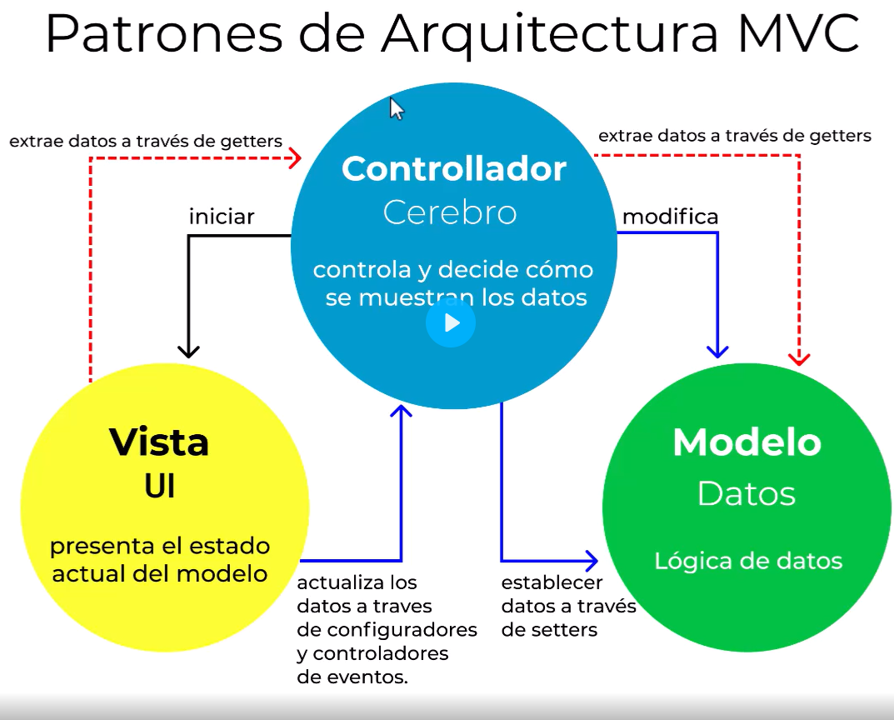

# Controladores

## Patrones de Arquitectura MVC



Los controladores se crean en la carpeta `app/Http/Controllers`

Para crear un controlador podemos hacerlo de forma manual desde cero o sino tambien usar un comando artisan:
```
php artisan make::controller PostController
```

Para el uso de este patron debemos entender un poco de que va, básicamente este patron nos dice que debemos tener nuestra lógica separada.

El controlador estará hecha de varias funciones que seran ejecutadas desde las rutas, un ejemplo de una función es:

```php
class PostController extends Controller
{
  public function index() {
    return "Hola desde la página de posts";
  }
}
```
y para que se pueda ejecutar desde las rutas simplemente hacemos lo siguiente
```php
Route::get('/posts', [PostController::class, 'index']);
```

Otro ejemplo:

PostController.php
```php
public function create() {
  return "Aqui se mostrar el formulario para crear un post";
}
```

Web.php
```php
Route::get('/posts/create', [PostController::class, 'create']);
```

Finalemente tendremos los dos archivos como a continuación
```php
public function index() {
  return "Hola desde la página de posts";
}

public function create() {
  return "Aqui se mostrar el formulario para crear un post";
}

public function store() {
  return "Aqui se procesará el formulario para crear un post";
}

public function show($post) {
  return "Aqui se mostrará un post: $post";
}

public function edit($post) {
  return "Aqui se mostrará el formulario para editar un post: $post";
}

public function update($post) {
  return "Aqui se procesara el formulario para editar un post $post";
}

public function destroy($post) {
  return "Aqui se eliminara un post: $post";
}
```
> Es importante que el name de las funciones sea tal cual en este archivo porque es una convención en laravel

Vemos que el archivo de rutas queda mucho mas limpio siguiendo el patron MVC
```php
// Ruta para mostrar todos los registros
Route::get('/posts', [PostController::class, 'index']);

// Ruta para mostrar un formulario para crear un registro
Route::get('/posts/create', [PostController::class, 'create']);

// Ruta para guardar un registro
Route::post('/posts', [PostController::class, 'store']);

// Ruta para mostrar un registro
Route::get('/posts/{post}', [PostController::class, 'show']);

// Ruta para mostrar un formulario para editar un registro
Route::get('/posts/{post}/edit', [PostController::class, 'edit']);

// Ruta para actualizar un registro
Route::put('/posts/{post}', [PostController::class, 'update']);

// Ruta para eliminar un registro
Route::delete('/posts/{post}', [PostController::class, 'destroy']);
```

Otra de las convenciones que tiene laravel, es que nombremos nuestras rutas:
```php
// Ruta para mostrar todos los registros
Route::get('/posts', [PostController::class, 'index'])
    ->name('posts.index');

// Ruta para mostrar un formulario para crear un registro
Route::get('/posts/create', [PostController::class, 'create'])
    ->name('posts.create');

// Ruta para guardar un registro
Route::post('/posts', [PostController::class, 'store'])
    ->name('posts.store');

// Ruta para mostrar un registro
Route::get('/posts/{post}', [PostController::class, 'show'])
    ->name('posts.show');

// Ruta para mostrar un formulario para editar un registro
Route::get('/posts/{post}/edit', [PostController::class, 'edit'])
    ->name('posts.edit');

// Ruta para actualizar un registro
Route::put('/posts/{post}', [PostController::class, 'update'])
    ->name('posts.update');

// Ruta para eliminar un registro
Route::delete('/posts/{post}', [PostController::class, 'destroy'])
    ->name('posts.destroy');
```

## Route Resource

El `Route::Resource` nos ayuda a simplificar todo el listado de rutas a una sola línea:
```php
Route::resource('posts', PostController::class);
```
Para que esto funcione lo único que tuvimos que hacer fue seguir las convenciones de laravel, es decir en nuestro controller tener las funciones con los nombres que laravel tiene por convención, es decir `index`, `show`, `store`, `update`, etc.

**Para solo listar algunas de las rutas**

Cuando tengamos solo algunas vistas por ejemplo en un blog, lo que tenemos es listar los blog, y mostrar cada uno de los blog, podemos hacer lo siguiente:
```php
Route::resource('posts', PostController::class)
      ->only(['index', 'show']);
```

Con esa función only le decimos que solo queremos esas rutas.

Ahora cuando nosotros estamos creando una api no querremos usar vistas para la web, solo querremos trabajar del lado del backend, para esto hacemos:
```php
Route::resource('posts', PostController::class)
      ->excep(['create', 'edit']);
```
Ahora tambien se puede hacer lo siguiente:
```php
Route::apiResource('posts', PostController::class);
```

**Ahora imaginemos que tenemos todo nuestro crud funcionando, sin embargo, el jefe del proyecto nos pide cambiar el nombre de la ruta a `articles`:**

Si nos piden ese cambio nos dara muchos errores y para solucionarlo deberíamos hacer los siguiente
```php
Route::resource('articles', PostController::class)
      ->parameters(['articles' => 'post'])
      ->names('post');
```

Ahora que pasa si nos piden que las rutas del crud esten en español, es decir que no digan `create` ni `edit`, sino creacion y edicion respectivamente.

La solución a esto es modificar un provider: `app/Providers/RouteServiceProvider.php` y modificamos la función boot
```php
public function boot(): void
{

    Route::resourceVerbs([
        'create' => 'crear',
        'edit' => 'editar',
    ]);

    RateLimiter...
```

## OJO

En Laravel, el enrutamiento de recursos permite asignar las rutas típicas de creación, lectura, actualización y eliminación ("CRUD") a un controlador con una sola línea de código. Para ello, se puede utilizar el comando make:controller del Artisan junto con la opción --resource para crear rápidamente un controlador que maneje estas acciones.

Por ejemplo, al ejecutar el siguiente comando se generará un controlador llamado PhotoController en app/Http/Controllers con métodos stub para cada una de las operaciones de recursos disponibles:

```
php artisan make:controller PhotoController --resource
```
Luego, se puede registrar una ruta de recursos en el archivo routes/web.php que apunte al controlador recién creado de la siguiente manera:
```php
use App\Http\Controllers\PhotoController;

Route::resource('photos', PhotoController::class);
```
Con esta única declaración de ruta se crean múltiples rutas para manejar una variedad de acciones en el recurso. Además, se puede registrar muchos controladores de recursos a la vez pasando una matriz al método resources() de la siguiente manera:
```php
Route::resources([
   'photos' => PhotoController::class,
   'posts' => PostController::class,
]);
```
Por último, siempre es recomendable ejecutar el comando route:list del Artisan para obtener una descripción general rápida de las rutas de la aplicación.
```
php artisan r:l
```
## Invoke

Anteriormete habiamos creado un contoller para el Home.

Este metodo solo tenia la vista de Home, es decir solo tiene un metodo en el controller el que seria el `index`

Cuando solo tenemos un metodo en el controller podemos usar los metodos invocables.

a continuacion un ejemplo:

Anteriormente teníamos un HomeController con un solo método:
```php
class HomeController extends Controller
{
    public function index() {
        return view('welcome');
    }
}
```

esto se puede transformar de la siguiente manera:
```php
class HomeController extends Controller
{
    public function __invoke() {
        return "Hola desde la página de inicio";
    }
}
```
y en el archivo de rutas tenemos

```php
Route::get('/', [HomeController::class]);
```

## Grupo de rutas

Hay veces que no solo usaremos el route--resource para agrupar nuestras rutas, en este caso usaremos:

a continuación:
```php
Route::controller(PostController::class)->group(function() {
  Route::get('/posts', 'index')->name('posts.index');
  Route::get('/posts/create', 'create')->name('posts.create');
  Route::post('/posts', 'store')->name('posts.store');
  Route::get('/posts/{post}', 'show')->name('posts.show');
  Route::get('/posts/{post}/edit', 'edit')->name('posts.edit');
  Route::put('/posts/{post}', 'update')->name('posts.update');
  Route::delete('/posts/{post}', 'destroy')->name('posts.destroy');
});
```

Lo que tambien podemos hacer es indicarle que todas las rutas empezaran con `/posts` lo mismo tambien para los names; quedando el codigo de la siguiente manera
```php
Route::prefix('/posts')->name('posts.')->controller(PostController::class)->group(function() {
    Route::get('/', 'index')->name('index');
    Route::get('/create', 'create')->name('create');
    Route::post('/', 'store')->name('store');
    Route::get('/{post}', 'show')->name('show');
    Route::get('/{post}/edit', 'edit')->name('edit');
    Route::put('/{post}', 'update')->name('update');
    Route::delete('/{post}', 'destroy')->name('destroy');
});
```

## Más

Los grupos de rutas en Laravel son una herramienta poderosa para compartir atributos de ruta, como el middleware, entre un conjunto de rutas, lo que evita tener que definir estos atributos en cada ruta individual. Además, los grupos anidados pueden fusionar de forma inteligente los atributos con su grupo principal, incluyendo middleware y condiciones "where", mientras que agregan nombres y prefijos automáticamente.

Por ejemplo, para asignar middleware a todas las rutas dentro de un grupo, simplemente usa el método middleware antes de definir el grupo. El **middleware** se ejecuta en el orden en que aparecen en la matriz:
```php
Route::middleware(['first', 'second'])->group(function () {
  Route::get('/', function () {
    // Usa los middlewares first y second...
  });

  Route::get('/user/profile', function () {
    // Usa los middlewares first y second...
  });
});
```
También puedes definir un controlador común para todas las rutas dentro de un grupo usando el método **controller**:
```php
use App\Http\Controllers\OrderController;

Route::controller(OrderController::class)->group(function () {
  Route::get('/orders/{id}', 'show');
  Route::post('/orders', 'store');
});
```
Además, los grupos de rutas también se pueden usar para manejar el enrutamiento de subdominios. A los subdominios se les pueden asignar parámetros de ruta, lo que le permite capturar una parte del subdominio para usar en su ruta o controlador. Para hacer esto, llama al método **domain** antes de definir el grupo:
```php
Route::domain('{account}.example.com')->group(function () {
  Route::get('user/{id}', function (string $account, string $id) {
    // ...
  });
});
```
El método prefix se puede usar para prefijar cada ruta en el grupo con un URI determinado, por ejemplo, puedes prefijar todos los URI de ruta dentro del grupo con "admin":
```php
Route::prefix('admin')->group(function () {
  Route::get('/users', function () {
    // Coincide con la URL "/admin/users"
  });
});
```
Finalmente, el método name se puede usar para prefijar cada nombre de ruta en el grupo con una cadena dada. Esto es útil para, por ejemplo, anteponer los nombres de todas las rutas del grupo con "admin":
```php
Route::name('admin.')->group(function () {
  Route::get('/users', function () {
    // Asigna el nombre de ruta "admin.users"...
  })->name('users');
});
```
